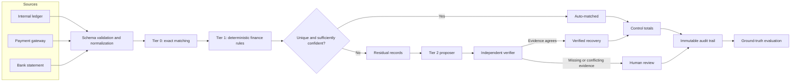

# AI Finance Controller

The AI Finance Controller reconciles a merchant's internal ledger, payment-gateway
captures, and bank settlements as one controlled workflow. These systems describe
the same movement of money from different points of view, so their records rarely
line up perfectly: fees reduce captured amounts, settlements arrive late, several
transactions may be batched, and operational references may be incomplete.

The system is intentionally conservative. It automates a match only when the
evidence is strong enough to defend later. Everything else becomes a categorized,
traceable exception for review.

## System architecture



The architecture separates finding a possible match from authorizing it. The
proposer can interpret messy narration, but it cannot close a transaction. The
verifier independently checks references, amount adjustments, uniqueness, and
confidence before a decision reaches the books.

## Reconciliation flow

1. **Load and validate the sources.** Schemas, identifiers, dates, timestamps, and
   integer-paise amounts are checked before matching begins.
2. **Apply exact rules first.** Direct order references, exact net amounts, and the
   expected settlement date receive the strongest confidence.
3. **Apply named deterministic tolerances.** Timing delays, rounding differences,
   batches, and partial settlements are handled by explicit finance rules.
4. **Abstain on ambiguity.** Duplicate captures, multiple candidates, and
   unexplained credits are not forced into a match.
5. **Send only the residual to Tier 2.** The proposer interprets narration and the
   verifier challenges its evidence under a maker-checker control.
6. **Reconcile control totals.** Raw variance is separated into documented
   adjustments, permitted rounding variance, and genuinely unexplained residual.
7. **Score against hidden truth.** Exact group membership—not confidence alone—
   determines whether a recovery was correct.
8. **Write the evidence.** The report, review queue, and record-level audit trail
   are generated without mutating the source records.

## Why the system is designed this way

| Design choice | Why it exists |
|---|---|
| Integer paise for money | Floating-point rounding is unacceptable in accounting controls. |
| Deterministic tiers first | Known finance rules are faster, cheaper, reproducible, and easier to audit. |
| Residual-only proposer | Model reasoning is reserved for evidence ordinary rules cannot interpret. |
| Independent verifier | A proposal is not approval; four-eyes control prevents self-authorization. |
| Unique-candidate gate | Two plausible matches are an exception, not permission to guess. |
| Cost-led confidence | A false close can corrupt books; a false exception costs review time. |
| Explained variance | Approved adjustments must not hide a real control-total break. |
| Hidden ground truth | Exact pairings are measured instead of rewarding confident output. |
| Immutable inputs | Decisions remain separate from the evidence they were based on. |
| Replay and abstain modes | The workflow remains reproducible and safe during API failure. |

## Matching tiers

### Tier 0 — exact

The ledger and gateway must agree on the order and gross amount. The bank credit
must equal gateway net and arrive at the expected T+2 date. These matches close at
confidence `1.0` because no tolerance or interpretation is involved.

### Tier 1 — deterministic controls

- `timing_window` accepts a documented settlement-delay window.
- `rounding_tolerance` accepts only a few paise of processor drift.
- `batched` finds a unique set of gateway transactions for one bank credit.
- `partial` finds multiple bank credits that uniquely sum to one transaction.
- `duplicate_detect` stops repeated captures for human void authorization.
- `orphan_detect` identifies bank money with no reconcilable commercial record.

Every rule records the tolerance it used. This keeps operational policy visible
instead of burying it in unexplained matching behavior.

### Tier 2 — propose, verify, or abstain

Tier 2 operates only on records left unresolved by deterministic controls. The
proposer extracts candidate references from bank narration. The verifier then
requires corroborating transaction and order references and checks that a narrated
adjustment equals the actual bank-to-gateway difference.

Missing corroboration becomes a resolvable miss. Contradictory evidence becomes a
successful safety escalation. Neither is silently auto-matched.

## Controls and failure behavior

The decision threshold uses an assumed INR 25 human-review cost and INR 10,000
false-auto-match remediation cost. This 400-to-1 difference explains the bias
toward review. The report includes a threshold cost curve so this policy can be
challenged rather than accepted as a hidden constant.

Control totals expose three distinct figures:

- **Raw settlement variance:** bank settlement minus matched gateway net.
- **Explained variance:** verified narrated adjustments and permitted rounding.
- **Unexplained residual:** raw variance remaining after known causes.

A nonzero unexplained residual is the actual accounting red flag. Every contributing
match is listed so the total can be traced back to individual records.

When the model API is unavailable, `abstain` mode escalates the Tier-2 residual and
preserves the deterministic baseline. Availability never weakens the decision gate.

## Evaluation

Evaluation joins decisions to `ground_truth.csv` using complete order, transaction,
and bank-UTR sets. A missing decision, partial grouping, or confident but incorrect
grouping does not count as a recovery.

The canonical seeded batch demonstrates the intended trade-off:

| Measure | Deterministic only | With verified Tier 2 |
|---|---:|---:|
| Match rate | 81.7% | 96.3% |
| Exception precision | 100.0% | 85.7% |
| Exception recall | 77.8% | 100.0% |
| Correct Tier-2 recoveries | — | 12 of 15 |
| Recovery accuracy | — | 80.0% |
| Correct safety escalations | — | 4 |
| Resolvable misses | — | 3 |
| False auto-matches added | — | 0 |

Lower exception precision means some valid matches were conservatively sent to
review. It does not mean bad records were silently auto-closed; the report makes
that distinction explicit.

## Data and outputs

Input files live in `data/`:

- `ledger.csv` — merchant orders and expected gross value
- `gateway.csv` — captures, fees, GST on fees, and net value
- `bank.csv` — settlement credits, value dates, and bank narration
- `ground_truth.csv` — hidden match groups used only by evaluation

Each run writes:

- `out/report.json` — metrics, ablation, costs, and control totals
- `out/exceptions.csv` — human-review queue with decision paths
- `out/audit_trail.csv` — record-level rules, evidence, confidence, and outcomes

## Project layout

```text
recon/
  config.py          business tolerances and cost assumptions
  models.py          immutable source and decision models
  load.py            schema validation and normalization
  engine.py          Tier 0 and Tier 1 reconciliation
  residual.py        residual isolation
  agents.py          proposer, verifier, replay, and abstain behavior
  openai_backend.py  optional hosted narration interpreter
  audit.py           audit and review-queue writers
  evaluate.py        hidden-truth scoring, ablation, and cost analysis

generate_data.py     reproducible synthetic batch generator
run_recon.py         reconciliation entry point
streamlit_app.py     read-only operational workbench
tests/               focused regression tests
```

## Running the system

```bash
python generate_data.py
python run_recon.py
python -m unittest discover -s tests -v
```

The default run uses checked-in replay for reproducible offline behavior. For live
model-backed narration interpretation, put credentials in the ignored `.env` file:

```text
OPENAI_API_KEY=your-openai-api-key
OPENAI_MODEL=gpt-5.5
```

```bash
python run_recon.py --agent-backend openai
```

Safe API-down behavior and the operational workbench are available with:

```bash
python run_recon.py --agent-backend abstain
python -m pip install -r requirements.txt
streamlit run streamlit_app.py
```

## Scope

This repository closes one reconciliation loop. Forecasting, settlement Q&A,
multiple-model orchestration, and automated bank actions are deliberately outside
the system. Keeping these boundaries explicit makes the implemented controls easier
to test, explain, and trust.
