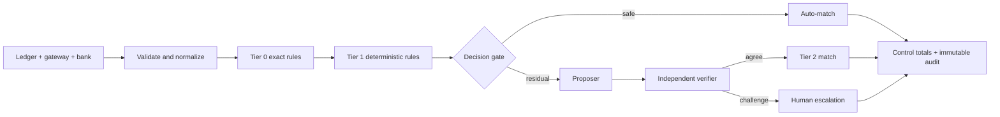

# AI Finance Controller

A merchant's cash trail disagrees across the order ledger, payment gateway, and bank.
This controller closes safe cases deterministically, abstains when evidence is not
unique, sends only the hard residual through a maker-checker layer, and measures
exactly what that layer adds against a hidden answer key. The product is designed
around one finance principle: a cheap human review is better than a false close that
corrupts the books.

## Architecture



The verifier, not the proposer, owns the close decision. Every record ends with a
rule, confidence, tolerance, rationale, and immutable audit evidence.

## Honest canonical results

| Measure | Deterministic only | With verified Tier 2 |
|---|---:|---:|
| Match rate | 81.7% | 96.3% |
| Exception precision | 100.0% | 85.7% |
| Exception recall | 77.8% | 100.0% |
| Correct residual recoveries | — | 12 of 15 |
| Correct safety escalations | — | 4 |
| Resolvable misses | — | 3 |

Recovery accuracy is 80%, not a perfect score. All 12 attempted auto-recoveries
match the exact hidden pairing; three potentially resolvable cases are escalated
because corroborating evidence is absent. Four genuinely conflicting cases are
also escalated successfully.

The confidence gate is selected from expected business cost rather than F1:
one human review costs an assumed INR 25, while a false auto-close carries an
assumed INR 10,000 remediation cost. The report includes the resulting cost curve.

## Run

```bash
python generate_data.py
python run_recon.py
python -m unittest discover -s tests -v
```

The default checked-in replay makes the canonical demo byte-reproducible and is
identified in the report. To run the actual model-backed narration interpreter,
place your key in the ignored `.env` file created from `.env.example`:

```text
OPENAI_API_KEY=your-openai-api-key
OPENAI_MODEL=gpt-5.5
```

Then run:

```bash
python run_recon.py --agent-backend openai
```

The hosted adapter uses Structured Outputs, does not store responses, and never has
authority to close the books: the local verifier remains the maker-checker gate.

If the API is unavailable, preserve the deterministic baseline safely:

```bash
python run_recon.py --agent-backend abstain
```

## Demo

```bash
python -m pip install -r requirements.txt
streamlit run streamlit_app.py
```

Generated artifacts are written to `out/report.json`, `out/exceptions.csv`, and
`out/audit_trail.csv`.

## Three-minute demo

1. **0:00–0:30 — Problem:** show the three source files and explain that a false
   reconciliation corrupts books, while an exception costs one reviewer-minute.
2. **0:30–1:10 — Deterministic bulk:** run the canonical batch and point to the
   81.7% deterministic match rate, named tolerances, and control total.
3. **1:10–1:50 — Measured contribution:** show the side-by-side ablation. Tier 2
   correctly recovers 12 of 15 residual groups and refuses the other three.
4. **1:50–2:30 — Graceful failure:** click a `proposer_verifier_disagreement` row.
   Read the proposer evidence and verifier rejection; emphasize that no forced
   match reaches the books.
5. **2:30–3:00 — Controls:** show the 400x cost ratio, confidence curve, immutable
   audit row, and replay/API-down modes.

## Where does it break?

The system breaks where source evidence is missing or contradictory. It does not
hide that boundary: three otherwise resolvable cases go to review because a second
reference is absent, and four conflicting cases are deliberately rejected by the
verifier. New narration formats can also reduce model extraction quality, which is
why model output never bypasses the local uniqueness and maker-checker gates.

**Thesis:** deterministic bulk + honest abstention + measured agent recovery +
graceful escalation.

## Scope discipline

Settlement Q&A and forecasting remain roadmap items. There is no forecaster,
second model, custom frontend, or hyperparameter tuning in this build.
